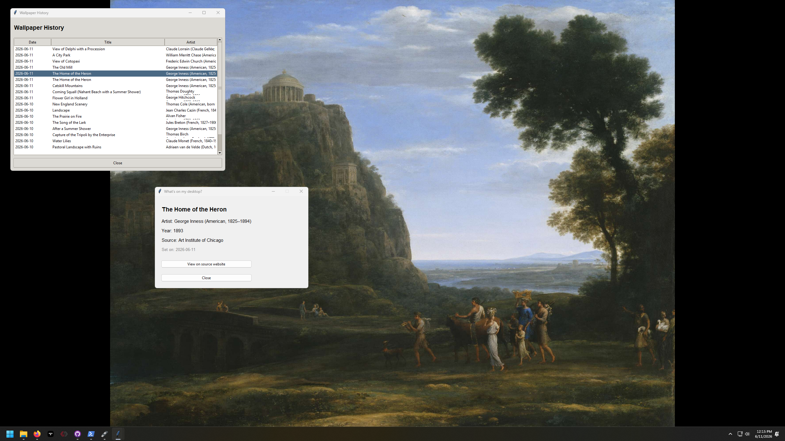

# PaintedDesktop

[](https://github.com/lflowers01/PaintedDesktop/actions)
[](https://github.com/lflowers01/PaintedDesktop/releases)
[](LICENSE)

Automatically set your Windows desktop wallpaper to a different high-resolution oil painting landscape every day.



## Features

- **Daily wallpaper rotation**: a new oil painting every day at a time you choose. If your PC was off or asleep at that time, it catches up as soon as it's back.
- **Sharp on any screen**: detects your real resolution (including high-DPI displays) and downloads each painting at exactly the size your screen needs
- **Oil landscapes only**: landscapes, seascapes and cityscapes (veduta) in oil, chosen in Settings
- **Three free museum sources**: Art Institute of Chicago, Rijksmuseum, and Wikimedia Commons. No accounts or API keys.
- **Never repeats**: paintings you've already had are skipped
- **Resilient**: if the internet isn't up yet (e.g. right after boot), it retries after 1, 2, 4, 8, then every 15 minutes
- **System tray controls**: click the icon to see what's on your desktop; right-click for everything else
- **Clean wallpapers**: no overlaid text or watermarks

## Installation

1. Download `PaintedDesktopSetup.exe` from the [latest release](https://github.com/lflowers01/PaintedDesktop/releases/latest)
2. Run it. No admin rights are needed; it installs just for your user.
3. PaintedDesktop starts right away and sits in your system tray (you may need to click the **^** arrow next to the clock)

Installing a new version over an old one keeps your settings and history.

## Usage

**Click** the tray icon to see the current painting. **Right-click** for the menu:

- **What's on my desktop?**: preview, title, artist, year and source, with a link to the painting's page
- **Change now**: fetch a new painting immediately; a notification tells you what it is
- **History**: every painting you've had, most recent first; double-click for details
- **Settings**
- **Exit**

## Settings

| Setting | Default | Description |
|---|---|---|
| New painting daily at | 08:00 | Time of day the wallpaper changes |
| Paintings | Landscapes, Seascapes | Landscapes, seascapes and/or cityscapes (veduta) |
| Display | Fit | **Fit** shows the whole painting with black bars; **Fill** covers the screen and crops the edges |
| Image size | Match my screen | Minimum image size; set a custom size for multi-monitor setups |
| Launch at startup | On | Start PaintedDesktop when you sign in to Windows |

## Art Sources

Tried in this order, falling back to the next if one is unavailable:

1. **[Art Institute of Chicago](https://api.artic.edu/docs/)**: public-domain oil paintings tagged with landscape, seascape or cityscape subjects
2. **[Rijksmuseum](https://data.rijksmuseum.nl/)**: Dutch Golden Age oils via the Linked Art API
3. **[Wikimedia Commons](https://commons.wikimedia.org/)**: the *Oil paintings of landscapes / seascapes / cityscapes* categories

## Where Data Lives

All app data is stored in `%APPDATA%\PaintedDesktop\` (Settings → **Open data folder**):

| File/Folder | Contents |
|---|---|
| `settings.json` | Your preferences |
| `history.json` | Every wallpaper that's been set |
| `cache/` | The last 30 images |
| `app.log` | Log file, rotates at 1 MB |

## Building from Source

Requires Python 3.10+ on Windows.

```bash
git clone https://github.com/lflowers01/PaintedDesktop.git
cd PaintedDesktop
python -m venv venv
venv\Scripts\activate
pip install -r PaintedDesktop/requirements.txt -r requirements-test.txt
python -m pytest tests          # run tests
python PaintedDesktop/main.py   # run from source
```

To build the installer, install [Inno Setup 6](https://jrsoftware.org/isinfo.php), then:

```bash
pip install pyinstaller
pyinstaller PaintedDesktop.spec
iscc installer/setup.iss        # -> installer/dist/PaintedDesktopSetup.exe
```

### Releasing

Bump `APP_VERSION` in `PaintedDesktop/settings.py`, commit, then push a matching tag (`git tag v2.0.1 && git push origin v2.0.1`). GitHub Actions runs the tests, builds the installer and publishes the release.

## Troubleshooting

**Tray icon not showing**: click the **^** arrow next to the clock; you can drag the icon onto the taskbar to keep it visible.

**Wallpaper not changing**: check `app.log` in the data folder, and try **Change now**, which shows a notification if it fails.

**Blurry wallpaper**: in Settings, make sure *Match my screen* is checked (or the custom size matches your display).

## License

MIT — see [LICENSE](LICENSE).

## Contributing

Open an issue or PR on [GitHub](https://github.com/lflowers01/PaintedDesktop/issues).